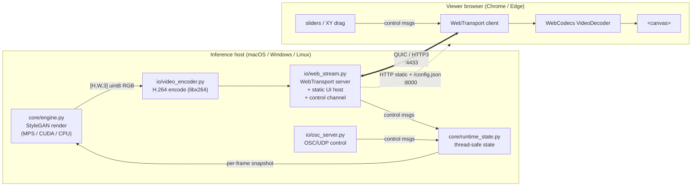
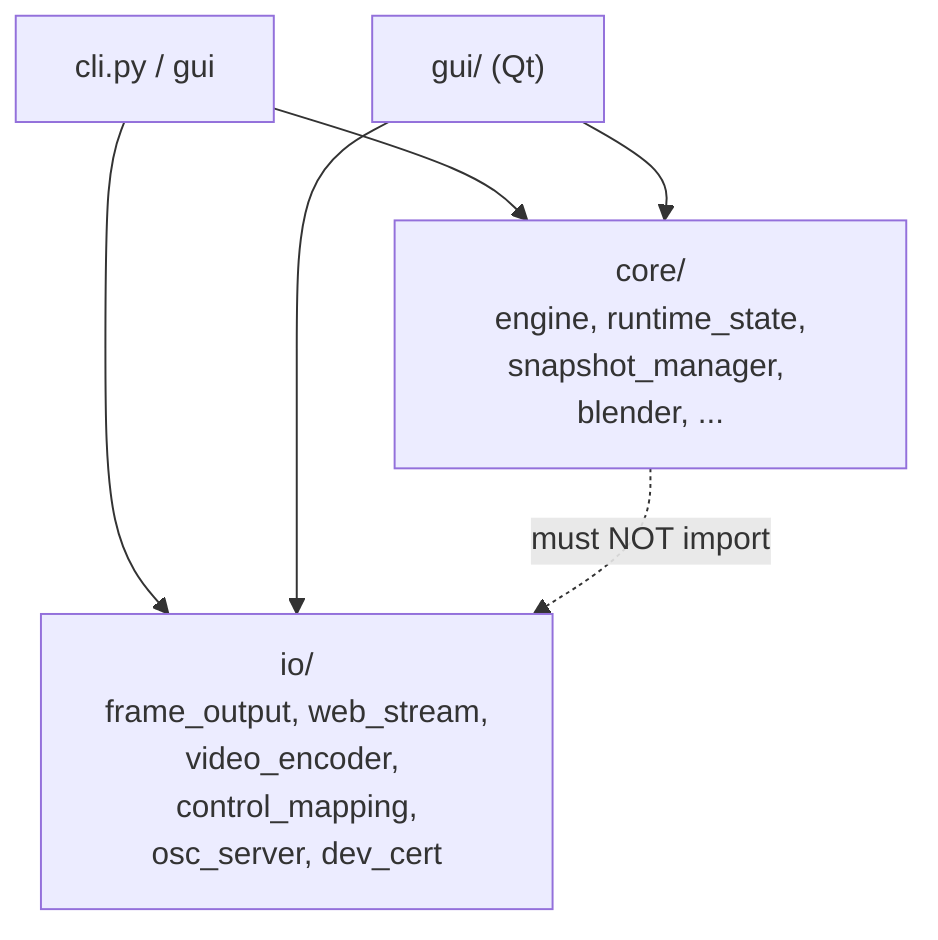
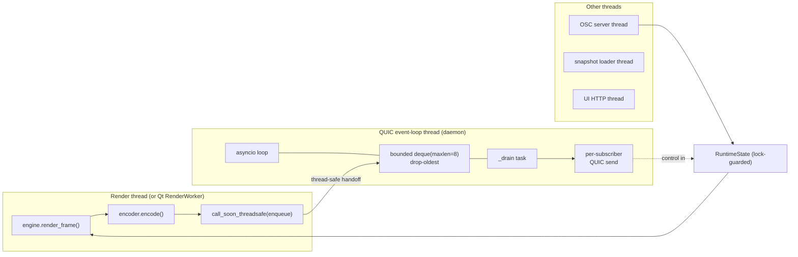
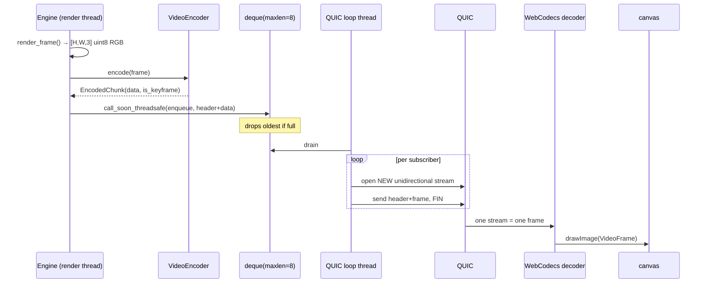
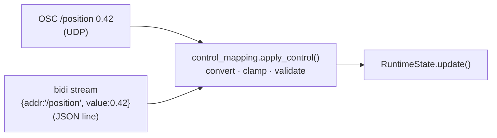
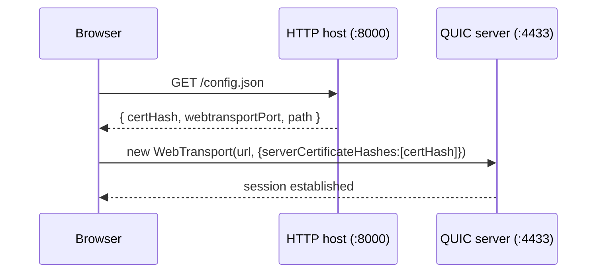
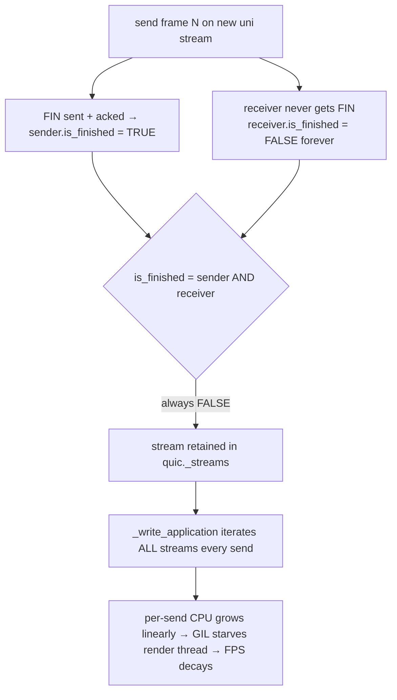
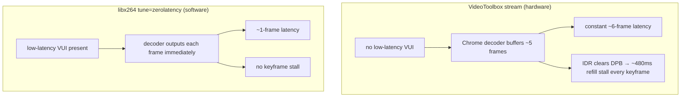

# Real-Time StyleGAN → Browser Streaming Architecture

> Status: **proof of concept.** This document describes the WebTransport +
> WebCodecs streaming path built into BalaGAN and is intended as the design
> basis for **Autolume 3.0**. It captures not just *what* the architecture is,
> but *why* — including every dead end, bug, and fix found while making it
> low-latency, because those lessons are the valuable part.

---

## 1. Goal and constraints

Stream a live StyleGAN render to an ordinary web browser with **high quality**
and **low latency**, with:

- **no native client install** (just a URL),
- **no GPU on the viewer side** (decode is hardware-accelerated by the browser),
- a **control channel** so the browser can drive the same parameters the OSC
  surface exposes (position, seed X/Y, seed animation, truncation).

Two transports were ruled out before this design:

| Rejected | Why |
| --- | --- |
| WebSocket (TCP) | TCP head-of-line blocking: one lost packet stalls *all* later frames → latency spikes. |
| aiortc / WebRTC | Hardcoded conservative bitrate caps quality; we want to own the encoder. |

The chosen stack — **WebTransport over HTTP/3 (QUIC)** for transport, **WebCodecs
`VideoDecoder`** for decode — gives us independent QUIC streams (no head-of-line
blocking between frames) and full control over the encoder and bitrate.

---

## 2. System overview



Three network endpoints on the host:

| Port | Protocol | Purpose |
| --- | --- | --- |
| `4433` | QUIC / HTTP/3 (WebTransport) | video downstream + control upstream |
| `8000` | HTTP (or HTTPS on LAN) | serves the browser client + `/config.json` |
| `7700` | UDP | OSC control (unchanged legacy path) |

---

## 3. Module layering

BalaGAN enforces a strict import direction: **`core` imports neither `io` nor
`gui`.** All networking and encoding lives in `io`. The streaming sink is an
*alternative* output selected at runtime — the existing Syphon/Spout path is
untouched.



The output sink is chosen by a factory so the two call sites (headless loop and
the Qt render worker) stay identical:

```
OutputSettings(kind = "auto" | "spout-syphon" | "web", ...)
        │
        ▼
io/frame_output.py::build_output()
        ├── "auto"/"spout-syphon" → platform FrameOutput (Syphon/Spout)  [unchanged]
        └── "web"                  → WebStreamOutput  (lazy import; QUIC + encoder)
```

Every sink implements the same contract:

```python
class FrameOutput:
    def __init__(self, name: str, width: int, height: int) -> None: ...
    def send(self, frame_uint8_rgb: np.ndarray) -> None:   # [H, W, 3] uint8 RGB
    def close(self) -> None: ...
```

`send()` is called once per frame, synchronously, from the render thread. The
web sink keeps this contract; everything asynchronous happens behind it.

---

## 4. Threading model

This is the heart of the design. `aioquic` needs an asyncio event loop, but the
render loop is a plain synchronous thread that must never block on the network.



Key rules:

- **The render thread never touches `aioquic`.** It hands encoded bytes to the
  loop via `loop.call_soon_threadsafe(...)`. Touching a `QuicConnection` from
  another thread corrupts its state.
- **Backpressure = drop-oldest.** Frames land in a `collections.deque(maxlen=8)`.
  If the network can't keep up, the oldest queued frame is dropped. Stale frames
  are worthless for live performance; we never block the renderer to deliver them.
- **Shared state is immutable + lock-guarded.** `RuntimeState` swaps a frozen
  `StateSnapshot` under a lock. OSC and the web control channel both write to it
  from their own threads; the render thread reads one snapshot per frame.

---

## 5. The frame pipeline (downstream)



### 5.1 Wire framing

Each frame is sent on its **own unidirectional QUIC stream** (one stream per
frame). A 13-byte header precedes the encoded payload:

```
 byte:   0        1   2   3   4    5   6   7   8   9  10  11  12   13 ...
       ┌────┐   ┌───────────────┐ ┌───────────────────────────┐ ┌────────┐
       │flag│   │   sequence    │ │     timestamp (ms)         │ │ H.264  │
       │ u8 │   │     u32 BE     │ │         u64 BE             │ │ Annex B│
       └────┘   └───────────────┘ └───────────────────────────┘ └────────┘
        bit0 = keyframe                                           payload
```

`struct ">BIQ"` = `flags(u8) | sequence(u32) | timestamp_ms(u64)`. The keyframe
flag lets the client refuse to start mid-GOP; the sequence and timestamp are for
diagnostics and decoder timestamps.

### 5.2 Bitstream format: Annex B, in-band parameter sets

The H.264 payload is **Annex B** (NAL units separated by `00 00 01` start codes,
with SPS/PPS carried in-band on each keyframe). The browser therefore configures
its decoder **without** a `description`:

```js
decoder.configure({ codec: "avc1.640028", optimizeForLatency: true });
// Annex B ⇒ no `description`. (AVCC would require the avcC description instead.)
```

> See §9.2 for the AVCC alternative and why it matters for some decoders.

---

## 6. The control channel (upstream)

The browser drives the render through the **same vocabulary as OSC**. The
address→state mapping is factored into `io/control_mapping.py` so OSC and the web
channel share one set of clamp/validation rules:



| Address | State field | Clamp |
| --- | --- | --- |
| `/position` | `position` | 0–1 |
| `/seedX` / `/seedY` | `latent_x` / `latent_y` | — |
| `/seedAnim` | `anim_playing` | int→bool |
| `/seedSpeedX` / `/seedSpeedY` | `anim_speed_x` / `anim_speed_y` | — |
| `/truncation` | `truncation_psi` | 0–1 |

On the WebTransport session, the client opens **one bidirectional stream** and
writes newline-delimited JSON. The server buffers per stream, splits on `\n`,
and calls `apply_control`. Because `RuntimeState` is lock-guarded, applying
updates from the QUIC loop thread is safe and coexists with OSC over UDP.

The browser UI maps gestures to these messages:

- **position / truncation** sliders → `/position`, `/truncation`
- **drag on the video canvas** → relative `/seedX` `/seedY` (mirrors the Qt
  viewport's Autolume drag: `delta_px × 4e-2 / 13`)
- **seed speed** sliders + **animate** toggle → `/seedSpeedX/Y`, `/seedAnim`

---

## 7. Hosting, certificates, and LAN access

The engine **hosts the browser client itself** (no separate `python -m
http.server`). When `--output web` is selected, `WebStreamOutput` starts a small
static HTTP server on a daemon thread serving the `web/` directory.

### 7.1 Zero-config certificate handoff

WebTransport requires TLS. For local dev we use a self-signed cert that the
browser trusts via `serverCertificateHashes` (constraints: ECDSA key, validity
≤ 14 days). Crucially, **nothing machine-specific is hardcoded in the client** —
the engine serves the cert hash and port at `/config.json`, and the client
fetches it on load:



### 7.2 Two traps that cost real debugging time

- **`localhost` resolves to IPv6 first.** The QUIC server binds IPv4
  (`0.0.0.0`); browsers often try `::1` and get `ERR_CONNECTION_REFUSED`. Fix:
  the client connects to `127.0.0.1` (or the LAN IP), and `serverCertificateHashes`
  skips hostname verification so the `localhost` cert still works.
- **Secure context required for WebTransport.** `http://<LAN-IP>` is *not* a
  secure context (only loopback and HTTPS are). To reach the client from another
  machine, `--web-host 0.0.0.0` serves the UI over **HTTPS** (same cert) for
  non-loopback hosts; loopback stays plain HTTP for a friction-free local case.

---

## 8. Issues found and fixed (the important part)

Everything above is the *result*. The path there exposed several non-obvious
failure modes. Each is worth internalizing for Autolume 3.0.

### 8.1 FPS decay from leaked QUIC streams ⭐

**Symptom.** Render FPS started at ~9.5 and slid steadily to ~4 over a couple of
minutes — but only *while a browser was connected*. With no subscriber, FPS was
rock-steady.

**Root cause.** We open one **unidirectional** QUIC stream per frame
(server→client, send-only). aioquic only frees a stream once it is
`is_finished`, defined as `sender.is_finished AND receiver.is_finished`. For a
*send-only* stream the receiver never sees a FIN, so `receiver.is_finished`
stays `False` **forever** → the stream is never discarded → `quic._streams`
grows without bound. `_write_application` iterates that dict on *every* send, so
per-send CPU grew linearly. Because aioquic runs in Python on the loop thread and
shares the GIL with the render thread, that growing cost **starved the renderer**.



**Fix.** After sending each frame's stream with FIN, mark the (non-existent)
receiver finished so aioquic can reclaim the stream once the FIN is acked. Done
defensively (it touches aioquic internals; on a version change it degrades to the
old behavior rather than crashing):

```python
def _finish_send_only_stream(quic, stream_id):
    try:
        quic._streams[stream_id].receiver.is_finished = True
    except (AttributeError, KeyError):
        pass  # aioquic internals moved; fall back to prior behaviour
```

**Regression test.** Send 100 frames to a loopback client; assert the resident
stream count stays bounded (was ~107, now < 20).

**Lesson for 3.0.** The "one stream per frame" WebTransport pattern is correct
for head-of-line isolation, but **send-only streams leak in aioquic**. Any
high-frame-rate server-push design must verify stream reclamation, or use a
transport library that handles it.

### 8.2 Keyframe freeze + multi-frame latency from the hardware encoder ⭐⭐

**Symptom (two faces of one cause).**
1. A **~1 s freeze every ~7 s** — frames kept arriving (queue empty, no loss),
   but the browser stopped painting for ~480 ms, then resumed.
2. A constant **~6-frame glass-to-glass latency** even on the same machine.

**Diagnosis path** (what each step ruled out):

| Hypothesis | Test | Result |
| --- | --- | --- |
| App queue buffering | `pending` stat | `0/8` always — not the queue |
| Encoder too slow | `encode ms/frame` stat | flat ~4 ms — not encode speed |
| Keyframe size / flow control | `--web-bitrate 6M` | freeze unchanged — not size |
| Out-of-order delivery | client `seq` logging | in order — not reordering |
| In-band SPS/PPS re-init | strip SPS/PPS per keyframe | freeze unchanged — not parameter sets |
| B-frames / reorder | probe `pts != dts` | `0` reorder, `max_b_frames=0` — not B-frames |
| **VideoToolbox bitstream** | **`--web-codec libx264`** | **freeze gone, latency 6→1 frame** ✅ |

**Root cause.** The freeze period exactly tracked the keyframe interval, and the
~480 ms ≈ 4–5 frames. Chrome's hardware H.264 decoder, fed VideoToolbox's
bitstream, **buffered ~5 frames before emitting** and **stalled at each IDR**
(the DPB clears at an IDR and the decoder refuses to output until it refills).
VideoToolbox omits the low-latency VUI signaling (`max_num_reorder_frames`,
`max_dec_frame_buffering`) that tells a decoder it can output immediately, even
though the stream has no B-frames and only one reference frame. `libx264`
`tune=zerolatency` *does* emit that signaling, so frames decode and display
immediately.



**Fix.** Default the web path to **`libx264`** (`tune=zerolatency`,
`preset=superfast`) on **every** platform. At ~1024 px, `superfast` encodes in
~4 ms/frame (`ultrafast` ~2 ms) — far below the ~100 ms inference budget — and
keeps the GPU free for inference. Hardware encoders remain selectable via
`--web-codec` for experimentation or native consumers.

**Lesson for 3.0.** *Hardware encode is not automatically the right choice for
browser delivery.* The decoder's behavior with the specific bitstream matters as
much as encode speed. Validate end-to-end glass-to-glass, not just "does it
encode fast." If hardware encode is required (e.g. 4K), either inject the
low-latency VUI into the SPS, or use NVENC's intra-refresh to avoid IDR spikes
(NVENC only — VideoToolbox has no intra-refresh), and re-measure.

### 8.3 Certificate hash hardcoding

**Symptom.** Committing a placeholder `CERT_HASH` broke the app on every fresh
checkout; committing a real hash leaked a machine-specific artifact.

**Fix.** Don't hardcode it. The engine already owns the cert *and* hosts the
page, so it serves the hash at `/config.json` and the client fetches it at
runtime (§7.1). Nothing machine-specific lives in any committed file.

**Lesson for 3.0.** Anything environment-specific (cert hash, ports, capability
flags) should be **served by the host to the client at runtime**, never baked
into client source.

### 8.4 Backpressure policy

A bounded `deque(maxlen=8)` with drop-oldest was correct from the start, but the
diagnostics confirmed it never filled on the same machine (`pending 0/8`). For
3.0 the queue size is the single knob trading latency (small) against tolerance
to transient stalls (large). For live performance, keep it small.

---

## 9. Latency considerations

### 9.1 Glass-to-glass budget

```
 render (MPS) ── encode ── enqueue/handoff ── QUIC ── decode ── canvas draw
   ~100 ms       ~4 ms        ~0 ms         <1 ms*   ~1 frame    ~1 ms
   (dominates)  (libx264                  (same      (libx264)
                superfast)                 machine)
```

\* On the same machine / LAN with no loss. The dominant cost is **inference**
(~100 ms/frame ≈ 9–10 fps), not the streaming path. With libx264 the *added*
latency over the local Qt window is **~1 frame**.

**Measuring it.** The `--debug` overlay bakes a per-frame counter into the image
*before* encode. Read the number off the Qt window and the browser canvas at the
same instant; the difference × frame period is the added glass-to-glass latency.
This is how the 6-frame (VideoToolbox) vs 1-frame (libx264) result was measured.

### 9.2 Latency levers, ranked

1. **Encoder low-latency signaling** (biggest win here): `tune=zerolatency`,
   no B-frames, single reference frame, low-latency VUI. This is the difference
   between 1 and 6 frames of decoder buffering.
2. **One QUIC stream per frame** — avoids head-of-line blocking between frames.
3. **Drop-oldest queue, small depth** — never trade latency for completeness.
4. **`optimizeForLatency: true`** on `VideoDecoder.configure`.
5. **Keyframe cadence** — see §10.

### 9.3 Codec framing: Annex B vs AVCC

We ship **Annex B** (in-band SPS/PPS, no `description`). It is simpler and
worked once the encoder choice was fixed. The alternative is **AVCC**: configure
the decoder once with an `avcC` `description`, then send length-prefixed NAL
units with the parameter sets stripped. AVCC is the textbook choice when a
decoder re-initializes on repeated in-band parameter sets. In our case parameter
sets were *not* the culprit (§8.2), so Annex B stayed. **For 3.0, prefer AVCC if
you target a wider range of decoders** — it removes per-keyframe parameter sets
entirely and configures the decoder deterministically.

---

## 10. Codec considerations summary

| Concern | Decision | Rationale |
| --- | --- | --- |
| Default encoder | **libx264** `tune=zerolatency` `preset=superfast` | Only stream Chrome decodes at low latency without keyframe stalls. |
| Hardware encoders | Selectable via `--web-codec` (VideoToolbox / NVENC) | Available for experimentation; not the browser default. |
| Profile | High (`avc1.640028`) | Matches the encoded stream; adjust if the encoder differs. |
| B-frames | **off** | Reorder adds latency; live streaming needs decode order = display order. |
| Reference frames | 1 | Minimizes decoder DPB buffering. |
| Bitrate | High (default 25 Mbps @ ~1024 px) | Quality is the point; QUIC + drop-oldest absorb bursts. |
| Keyframe interval | `fps × 2` (~60 frames) | Trades new-viewer startup time vs bandwidth (keyframes are ~10× a delta). |
| Framing | Annex B, in-band SPS/PPS | Simplest; AVCC is the upgrade path (§9.3). |

**Keyframe interval trade-off.** A new viewer can only start decoding at a
keyframe, so a long GOP delays first picture (up to the interval). A short GOP
costs bandwidth (keyframes are large). On a lossless LAN, keyframes are only
needed for viewer startup and loss recovery — so a longer GOP plus a forced
keyframe on each new connection would be ideal. (Not yet implemented; see below.)

---

## 11. Stream quality (measured)

How does a frame in the browser compare to the raw engine frame? Two facts frame
the answer:

1. **The browser frame equals the decoded frame.** H.264 decode is
   deterministic, so there is no "browser-specific" quality loss — every
   conformant decoder produces the same pixels from the same bitstream. All
   difference from the raw frame comes from the **encode**.
2. **Encoding has two independent loss sources:** RGB→YUV **4:2:0 chroma
   subsampling** (fixed, bitrate-independent — halves colour resolution) and
   **H.264 quantization** (bitrate-dependent).

### 11.1 End-to-end measurement on real snapshots

Real StyleGAN frames (1024×1024, MPS) → default web encoder (`libx264`
`superfast` `tune=zerolatency`, 25 Mbps) → H.264 decode, compared per pixel:

| Measure | PSNR |
| --- | --- |
| **Mean over 90 frames** | **42.7 dB** (min 41.7, max 46.4) |
| Keyframe (intra) | ~46 dB |
| P-frames (typical) | 42–44 dB |
| Chroma-4:2:0 floor on a real frame (no compression) | 48.8 dB |

**Verdict: visually near-lossless.** At ~43 dB the raw and decoded frames are
practically indistinguishable; the residual loss is faint ringing around
high-contrast detail (hair, edges).

**Content matters more than the codec knobs.** On photographic/face content the
chroma-subsampling floor is very high (48.8 dB) — soft skin tones barely suffer
from 4:2:0 — so the (small) limiting factor here is H.264 quantization, meaning a
higher bitrate would still nudge quality up. On synthetic content with hard
saturated colour edges the opposite holds: 4:2:0 becomes the ~41 dB ceiling and
extra bitrate barely helps. Measure on representative content before tuning.

### 11.2 What PSNR means

**Peak Signal-to-Noise Ratio** — a standard pixel-fidelity measure on a
logarithmic decibel scale, computed from the mean squared per-pixel error:
`PSNR = 20·log₁₀(255) − 10·log₁₀(MSE)`. Higher is better (identical = ∞).

| PSNR | Meaning |
| --- | --- |
| > 45 dB | essentially indistinguishable |
| 40–45 dB | excellent — invisible in normal viewing (**we are here**) |
| 35–40 dB | very good; minor artifacts on close inspection |
| 30–35 dB | visible compression artifacts |
| < 30 dB | clearly degraded |

PSNR is a quick proxy, not a perfect model of perception (SSIM / VMAF track
perception better), but at ~43 dB the conclusion is unambiguous.

### 11.3 The 4:2:0 ceiling

To exceed the chroma-subsampling floor you would need **4:4:4** encoding, which
browser hardware H.264 decode generally does **not** support. So 4:2:0 is the
practical quality ceiling for broad browser compatibility — fine here, but a
constraint to remember if Autolume 3.0 ever needs pixel-exact colour.

---

## 12. Recommendations for Autolume 3.0

Concrete carry-forwards, roughly in priority order:

1. **Keep the layering and the sink contract.** `core` free of `io`/`gui`; a
   single `send(frame_uint8_rgb)` contract; a factory selecting the sink. This
   made the streaming path a drop-in alternative to Syphon/Spout.
2. **Default to a software low-latency encoder for browser delivery**; treat
   hardware encode as an opt-in to be validated end-to-end per platform/decoder.
3. **Verify QUIC stream reclamation** under sustained server push, or pick a
   transport stack that guarantees it. The send-only-stream leak (§8.1) is a
   sharp edge.
4. **Serve runtime config to the client** (cert hash, ports, capabilities) via a
   `/config.json`-style endpoint. Never hardcode environment state.
5. **Force a keyframe on new-viewer connect + lengthen the GOP**, so steady-state
   bandwidth drops without hurting startup. Requires on-demand IDR from the
   encoder (libx264 supports forced IDR).
6. **Consider AVCC framing** (§9.3) for broader decoder compatibility.
7. **Out of scope here, natural next steps for scale:** many-viewer fan-out, an
   SFU/relay (MoQ / media-over-QUIC), authentication, and Safari support
   (WebTransport + WebCodecs reached parity only recently).
8. **Keep the `--debug` frame counter.** It is the cheapest, most reliable
   glass-to-glass latency probe available.

---

## 13. File map

| File | Responsibility |
| --- | --- |
| `src/balagan/core/engine.py` | StyleGAN render loop; `[H,W,3]` uint8 RGB out; `--debug` frame counter |
| `src/balagan/io/frame_output.py` | `OutputSettings`, `build_output()` factory, Syphon/Spout dispatch |
| `src/balagan/io/web_stream.py` | `WebStreamOutput`: QUIC server, per-frame uni streams, UI host, `/config.json`, control channel, stream-leak fix |
| `src/balagan/io/video_encoder.py` | `EncoderConfig`, `config_for(codec)`, `DEFAULT_WEB_CODEC`, `VideoEncoder` |
| `src/balagan/io/control_mapping.py` | `apply_control()` — shared OSC/web vocabulary |
| `src/balagan/io/osc_server.py` | OSC/UDP control (delegates to `control_mapping`) |
| `src/balagan/io/dev_cert.py` | self-signed ECDSA cert generation + `cert_sha256()` |
| `web/index.html`, `web/main.js` | dependency-free browser client (WebTransport + WebCodecs + controls) |
| `web/generate_cert.py` | dev cert CLI wrapper |

Run it:

```bash
uv run python web/generate_cert.py                 # once; writes web/certs/
uv run balagan --snapshots-dir <run> --output web  # then open http://127.0.0.1:8000
# add --web-host 0.0.0.0 to reach it from another machine on the LAN (HTTPS)
```
